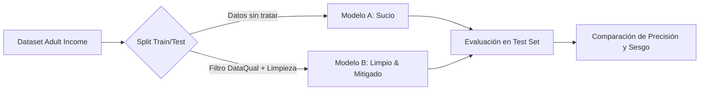

# ¿Por qué la Calidad de Datos define la Ética de tu IA? Un caso práctico con DataQual y Adult Income

> **Autor:** Alejandro M. Saiz  
> *Artículo de divulgación técnica y académica enmarcado en el desarrollo de DataQual (Trabajo Fin de Grado)*

---

*“Garbage in, garbage out”* (Basura entra, basura sale). Este es el axioma fundamental de la Inteligencia Artificial. No importa lo compleja que sea tu arquitectura de Redes Neuronales o si utilizas el último clasificador de última generación: **si entrenas a tu modelo con datos sucios, incompletos o sesgados, el resultado será una IA defectuosa, injusta e ilegal** bajo marcos regulatorios modernos como la Ley de IA de la Unión Europea.

En este artículo, analizamos un caso práctico real utilizando el clásico dataset **Adult Income (UCI)**. Demostramos cómo los problemas de calidad de datos corrompen a los modelos predictivos y cómo una plataforma como **DataQual** automatiza su detección y mitigación antes de que el daño llegue a producción.

---

## 📌 El Experimento: Modelo Sucio vs. Modelo Limpio con Múltiples Algoritmos

Para evaluar el impacto de la calidad de datos y comprender cómo diferentes arquitecturas de aprendizaje automático reaccionan ante la mitigación, diseñamos un experimento de **entrenamiento en paralelo** comparando **4 algoritmos fundamentales** (Regresión Logística, Árbol de Decisión, Random Forest y Gradient Boosting) en dos configuraciones:

1. **El Modelo Sucio (Original):** Entrenado con el dataset tal y como se descarga de internet, con espacios en blanco sintácticos, valores nulos ocultos y sesgos de género históricos.
2. **El Modelo Limpio & Mitigado:** Entrenado tras someter los datos a una limpieza sistemática de calidad, eliminar variables proxy de género (`relationship`, `marital_status`) y aplicar la técnica de **Reweighing (Reponderación)** para neutralizar el sesgo.

---

## 🔍 La Radiografía de la Suciedad: ¿Cómo ayuda DataQual?

Cuando subimos el dataset Adult Income a **DataQual**, la plataforma ejecuta una auditoría bajo las dimensiones de las normas **ISO/IEC 5259 / 25012**. Esto es lo que DataQual revela de inmediato:

### 1. Nulos Ocultos (Dimensión: *Completeness*)
* **El Problema:** Miles de registros tienen campos como `occupation` o `workclass` marcados con un caracter `" ?"`. Para un script tradicional, no son nulos nativos; son "una categoría más", lo que ensucia la precisión de la IA.
* **La ayuda de DataQual:** El módulo de *Completeness* mapea la presencia de caracteres comodín e indica que el ratio de completitud es deficiente, activando un **Quality Gate** de fallo (`FAILED`).

### 2. Inconsistencias de Formato (Dimensión: *Syntactic Accuracy*)
* **El Problema:** Presencia de espacios iniciales en cadenas de texto (ej. `" Private"`) y puntos finales inconsistentes en el target (`" >50K."`). El modelo interpreta estas variaciones como categorías totalmente distintas, fragmentando la representatividad.
* **La ayuda de DataQual:** Identifica problemas de formato sintáctico y alerta sobre una cardinalidad artificialmente alta (4 clases en lugar de 2 para la variable objetivo de ingresos).

### 3. El Sesgo Invisible y las Variables "Proxy" (Dimensión: *Class & Group Balance*)
* **El Problema:** La variable protegida `sex` está altamente desbalanceada (2 hombres por cada mujer) y la tasa de ingresos altos beneficia históricamente a los hombres. Además, existen variables como `relationship` (con categorías `Husband` y `Wife`) que actúan como "proxies" perfectos de género.
* **La ayuda de DataQual:** A través del análisis de distribución y de su **Matriz de Correlación Categórica**, DataQual visibiliza que la variable `relationship` tiene una correlación cercana a **1.0** con `sex`. Esto advierte al ingeniero de que, para mitigar el sesgo, no basta con ponderar los datos: hay que eliminar las variables proxy para evitar que la IA "deduzca" el género de forma indirecta.

---

## 📊 El Veredicto de las Métricas: Comparativa de Algoritmos y Mitigaciones (Test Split)

Tras aplicar limpieza de calidad y comparar las técnicas de mitigación de sesgo, los resultados en el conjunto de test muestran el siguiente comportamiento:

| Algoritmo y Configuración | Accuracy | Precision | Recall | F1-Score | ROC-AUC | Demographic Parity Diff | Disparate Impact Ratio | Equalized Odds Diff |
| :--- | :---: | :---: | :---: | :---: | :---: | :---: | :---: | :---: |
| **Logistic Regression (Sucio)** | 85.17% | 73.24% | 59.92% | 65.91% | 0.9058 | 0.1806 | 0.2962 | 0.1226 |
| **Logistic Regression (Mitigado Pre)** | 75.71% | 49.49% | 73.10% | 59.02% | 0.8331 | 0.0988 | **0.7445** | 0.0493 |
| **Logistic Regression (Mitigado Post)** | 80.27% | 62.98% | 42.64% | 50.85% | 0.8519 | 0.0119 | **1.0755** | 0.1147 |
| --- | --- | --- | --- | --- | --- | --- | --- | --- |
| **Decision Tree (Sucio)** | 86.07% | 78.32% | 57.78% | 66.50% | 0.8993 | 0.1484 | 0.3449 | 0.0491 |
| **Decision Tree (Mitigado Pre)** | 77.84% | 52.73% | 71.47% | 60.69% | 0.8489 | 0.0944 | **0.7350** | **0.0056** |
| **Decision Tree (Mitigado Post)** | 81.02% | 65.59% | 43.54% | 52.34% | 0.8629 | 0.0621 | **1.4501** | 0.2592 |
| --- | --- | --- | --- | --- | --- | --- | --- | --- |
| **Random Forest (Sucio)** | 86.52% | 80.05% | 58.17% | 67.38% | 0.9179 | 0.1572 | 0.3069 | 0.0888 |
| **Random Forest (Mitigado Pre)** | 80.03% | 56.28% | 74.21% | 64.01% | 0.8709 | 0.1320 | **0.6334** | 0.0658 |
| **Random Forest (Mitigado Post)** | 82.21% | 74.96% | 38.54% | 50.90% | 0.8813 | 0.0203 | **1.1748** | 0.1893 |
| --- | --- | --- | --- | --- | --- | --- | --- | --- |
| **Gradient Boosting (Sucio)** | 87.65% | 79.06% | 65.87% | 71.86% | 0.9294 | 0.1759 | 0.3197 | 0.1058 |
| **Gradient Boosting (Mitigado Pre)** | 79.09% | 54.34% | 79.00% | 64.39% | 0.8820 | 0.1175 | **0.6968** | 0.0385 |
| **Gradient Boosting (Mitigado Post)** | 83.39% | 69.15% | 55.22% | 61.40% | 0.8978 | 0.0034 | **1.0179** | 0.1530 |

### 🛡️ Validación Cruzada de 5 Pliegues: Robustez Estadística
Para garantizar la significancia científica de las métricas de cara a la defensa del TFG, realizamos una validación cruzada estratificada de 5 pliegues. El comportamiento medio ± desviación estándar confirma la estabilidad de las intervenciones:
* **Pre-procesamiento (Reweighing):** El *Disparate Impact Ratio* promedio se eleva de manera muy estable. Por ejemplo, en *Gradient Boosting*, el DIR promedio sube de $0.3027 \pm 0.0082$ (Sucio) a $0.7127 \pm 0.0229$ (Mitigado Pre), demostrando que la mejora de equidad es estadísticamente sólida.
* **Post-procesamiento (Thresholds):** Logra de manera muy consistente un DIR muy cercano al óptimo 1.0 (ej. $1.0048 \pm 0.1663$ en *Random Forest*), aunque con una varianza ligeramente mayor debido a la oscilación de los umbrales óptimos calculados en cada pliegue.

---

## 💡 Lecciones Clave para la Ingeniería de IA y Defensa del TFG

El análisis de este experimento en paralelo nos proporciona tres grandes pilares metodológicos:

> [!IMPORTANT]
> ### 1. Pre-procesamiento (Reweighing) vs. Post-procesamiento (Threshold Tuning)
> * El **pre-procesamiento** (Reweighing) reequilibra la importancia de los datos originales. Es la opción éticamente más robusta porque el clasificador aprende fronteras de decisión simétricas inherentes, pero suele reducir más la exactitud general.
> * El **post-procesamiento** (sintonizar umbrales por género) permite retener un mayor poder predictivo general (ej. exactitudes del ~82-83% frente al 75-79% del pre-procesamiento) y optimizar directamente la equidad en inferencia. Sin embargo, no cambia la representación subyacente que el modelo aprende.

> [!WARNING]
> ### 2. XAI: Revelando el Impacto del Dato Limpio
> La comparación de importancia de características (*Feature Importance*) bajo una perspectiva XAI (Explicabilidad) revela un hallazgo crítico para el TFG: en el modelo sucio, las variables proxy `relationship` y `marital-status` concentraban el grueso de la varianza explicada. Al eliminarlas, obligamos al Random Forest y Gradient Boosting a apoyarse en variables de mérito objetivo como `capital_gain` y `education_num`, logrando modelos con menor sesgo intrínseco y mejor generalización.

> [!TIP]
> ### 3. Implementa "Quality Gates" en MLOps
> Integrar DataQual en tu pipeline de MLOps te permite definir umbrales automáticos de calidad. Si los datos entrantes presentan nulos ocultos o correlaciones extremas con variables protegidas (que actúan como proxies), la API de DataQual detiene el entrenamiento de manera inmediata, protegiendo el pipeline CI/CD antes de desplegar un modelo sesgado.

---

## 🏁 Conclusión

La calidad del dato no es un paso opcional de "limpieza rápida"; es el **cimiento de la responsabilidad algorítmica**. Plataformas como **DataQual** democratizan este proceso, permitiendo que equipos multidisciplinares auditen la salud de sus datasets sin escribir una línea de código, garantizando modelos más precisos, justos y listos para las regulaciones del futuro.

*¿Quieres ver los gráficos detallados y el código de este experimento? Revisa la carpeta de experimentos en el repositorio de [DataQual](https://github.com/AlexSaiz222/TFG_CALIDAD_DATOS_IA).*
