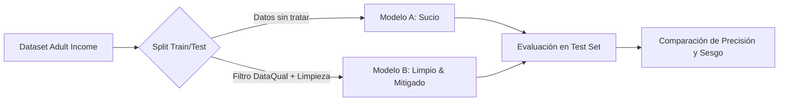

# ¿Por qué la Calidad de Datos define la Ética de tu IA? Un caso práctico con DataQual y Adult Income

> **Autor:** Alejandro M. Saiz  
> *Artículo de divulgación técnica y académica enmarcado en el desarrollo de DataQual (Trabajo Fin de Grado)*

---

*“Garbage in, garbage out”* (Basura entra, basura sale). Este es el axioma fundamental de la Inteligencia Artificial. No importa lo compleja que sea tu arquitectura de Redes Neuronales o si utilizas el último clasificador de última generación: **si entrenas a tu modelo con datos sucios, incompletos o sesgados, el resultado será una IA defectuosa, injusta e ilegal** bajo marcos regulatorios modernos como la Ley de IA de la Unión Europea.

En este artículo, analizamos un caso práctico real utilizando el clásico dataset **Adult Income (UCI)**. Demostramos cómo los problemas de calidad de datos corrompen a los modelos predictivos y cómo una plataforma como **DataQual** automatiza su detección y mitigación antes de que el daño llegue a producción.

---

## 📌 El Experimento: Modelo Sucio vs. Modelo Limpio

Para evaluar el impacto de la calidad de datos, diseñamos un experimento de **entrenamiento en paralelo** utilizando un algoritmo de *Random Forest*:

1. **El Modelo Sucio (Original):** Entrenado con el dataset tal y como se descarga de internet, con espacios en blanco sintácticos, valores nulos ocultos y sesgos de género históricos.
2. **El Modelo Limpio & Mitigado:** Entrenado tras someter los datos a una limpieza sistemática de calidad y aplicar la técnica de **Reweighing (Reponderación)** para neutralizar el sesgo de género.

---

## 🔍 La Radiografía de la Suciedad: ¿Cómo ayuda DataQual?

Cuando subimos el dataset Adult Income a **DataQual**, la plataforma ejecuta una auditoría bajo las dimensiones de las normas **ISO/IEC 5259 / 25012**. Esto es lo que DataQual revela de inmediato:

### 1. Nulos Ocultos (Dimensión: *Completeness*)
* **El Problema:** Miles de registros tienen campos como `occupation` o `workclass` marcados con un caracter `" ?"`. Para un script tradicional, no son nulos nativos; son "una categoría más", lo que ensucia la precisión de la IA.
* **La ayuda de DataQual:** El módulo de *Completeness* mapea la presencia de caracteres comodín e indica que el ratio de completitud es deficiente, activando un **Quality Gate** de fallo (`FAILED`).

### 2. Inconsistencias de Formato (Dimensión: *Syntactic Accuracy*)
* **El Problema:** Presencia de espacios iniciales en cadenas de texto (ej. `" Private"`) y puntos finales inconsistentes en el target (`" >50K."`). El modelo interpreta estas variaciones como categorías totalmente distintas, fragmentando la representatividad.
* **La ayuda de DataQual:** Identifica problemas de formato sintáctico y alerta sobre una cardinalidad artificialmente alta (4 clases en lugar de 2 para la variable objetivo de ingresos).

### 3. El Sesgo Invisible y las Variables "Proxy" (Dimensión: *Class & Group Balance*)
* **El Problema:** La variable protegida `sex` está altamente desbalanceada (2 hombres por cada mujer) y la tasa de ingresos altos beneficia históricamente a los hombres. Además, existen variables como `relationship` (con categorías `Husband` y `Wife`) que actúan como "proxies" perfectos de género.
* **La ayuda de DataQual:** A través del análisis de distribución y de su **Matriz de Correlación Categórica**, DataQual visibiliza que la variable `relationship` tiene una correlación cercana a **1.0** con `sex`. Esto advierte al ingeniero de que, para mitigar el sesgo, no basta con ponderar los datos: hay que eliminar las variables proxy para evitar que la IA "deduzca" el género de forma indirecta.

---

## 📊 El Veredicto de las Métricas: Modelo Sucio vs. Modelo Limpio

Tras corregir los nulos, eliminar los proxies y aplicar reponderación en base a las métricas de DataQual, los resultados del entrenamiento paralelo revelan un comportamiento fascinante:

| Métrica de Evaluación | Modelo Sucio (Original) | Modelo Limpio & Mitigado | Diagnóstico e Impacto del Cambio |
| :--- | :---: | :---: | :--- |
| **Accuracy (Exactitud)** | 86.52% | 80.03% | Ajuste del 6% debido al trade-off de equidad. |
| **Recall (Sensibilidad)** | 58.17% | **74.21%** | **Mejora del +16.04%** al corregir el desbalance de clase. |
| **Demographic Parity Diff** | 0.1572 | **0.1320** | Reducción de la brecha absoluta de selección. |
| **Disparate Impact Ratio (DIR)** | 0.3069 | **0.6334** | **Mejora del +106%** hacia la equidad legal. |
| **Equalized Odds Difference** | 0.0888 | **0.0658** | Las tasas de error se equilibran entre géneros. |

---

## 💡 Lecciones Clave para la Ingeniería de IA

El análisis de este experimento nos deja tres grandes conclusiones aplicables a cualquier proyecto de Inteligencia Artificial:

> [!IMPORTANT]
> ### 1. El Dilema del Trade-Off (Equidad vs. Rendimiento)
> El Modelo Sucio parece tener una exactitud altísima (86.5%), pero es una ilusión: está sobreajustado a predecir que las mujeres no ganan dinero debido al sesgo histórico. El Modelo Limpio tiene un 80.0% de exactitud, pero es **éticamente robusto y generaliza mejor**, al no depender de prejuicios históricos para predecir.

> [!WARNING]
> ### 2. La Trampa de los Proxies de Sesgo
> Si intentas mitigar el sesgo aplicando pesos a la muestra pero dejas variables proxy como `relationship` (esposo/esposa), la IA aprenderá a ignorar tus pesos y reconstruirá el género a través de ellas. La auditoría previa en DataQual es vital para identificar y extirpar estas variables antes del entrenamiento.

> [!TIP]
> ### 3. Implementa "Quality Gates" en MLOps
> Integrar DataQual en tu pipeline de MLOps te permite definir umbrales automáticos. Si el dataset entrante no supera los umbrales de completitud, balance o balance de grupos sensibles, el despliegue a producción se detiene. Es el equivalente de *SonarQube* pero para la salud de tus datos.

---

## 🏁 Conclusión

La calidad del dato no es un paso opcional de "limpieza rápida"; es el **cimiento de la responsabilidad algorítmica**. Plataformas como **DataQual** democratizan este proceso, permitiendo que equipos multidisciplinares auditen la salud de sus datasets sin escribir una línea de código, garantizando modelos más precisos, justos y listos para las regulaciones del futuro.

*¿Quieres ver los gráficos detallados y el código de este experimento? Revisa la carpeta de experimentos en el repositorio de [DataQual](https://github.com/AlexSaiz222/TFG_CALIDAD_DATOS_IA).*
