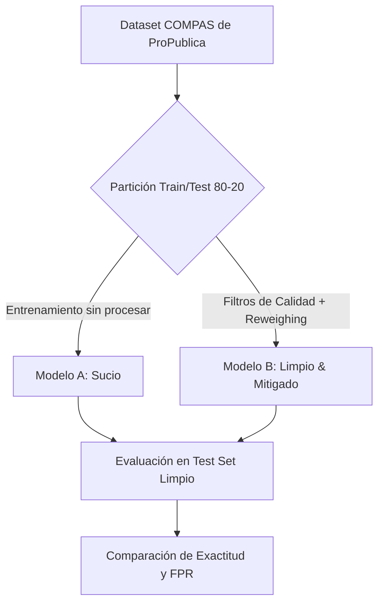

# Sesgo Racial e Inteligencia Artificial: Replicando el Caso COMPAS con DataQual

> **Autor:** Alejandro M. Saiz  
> *Artículo de divulgación técnica y académica enmarcado en el desarrollo de DataQual (Trabajo Fin de Grado)*

---

En 2016, una investigación del medio periodístico *ProPublica* sacudió los cimientos del sector tecnológico: el software **COMPAS**, utilizado por jueces en Estados Unidos para evaluar la probabilidad de reincidencia de los acusados, mostraba un sesgo racial sistemático. Las personas afroamericanas eran calificadas erróneamente como de "alto riesgo" de reincidencia casi al doble de la tasa que las personas caucásicas.

Este caso histórico es el ejemplo más citado sobre por qué la calidad de datos y la equidad (*fairness*) son inseparables en la era de la IA. En este artículo, recreamos este experimento entrenando dos clasificadores en paralelo y demostramos cómo **DataQual** ayuda a diagnosticar inconsistencias lógicas en el dato y cómo mitigarlas para lograr una IA justa.

---

## 📌 El Experimento: Modelo Sucio vs. Modelo Limpio con Múltiples Algoritmos

Para este caso de estudio, tomamos el dataset de COMPAS liberado por ProPublica y entrenamos en paralelo **4 algoritmos fundamentales de Machine Learning** (Regresión Logística, Árbol de Decisión, Random Forest y Gradient Boosting) para predecir si un acusado reincidirá dentro de dos años (`two_year_recid`):

1. **El Modelo Sucio (Original):** Entrenado con el dataset raw, incluyendo registros corruptos y sin ningún tipo de control de equidad.
2. **El Modelo Limpio & Mitigado:** Filtrado bajo reglas de consistencia de datos, eliminando las predicciones originales del software (que actúan como proxies) y aplicando **Reweighing (Reponderación)** para neutralizar el sesgo racial.

---

## 🔍 La Auditoría de Datos: ¿Cómo ayuda DataQual?

Subir el dataset de COMPAS a **DataQual** revela que los problemas éticos del algoritmo original estaban íntimamente ligados a deficiencias en la **calidad lógica** del dataset:

### 1. Inconsistencias Temporales (Dimensión: *Logical Consistency*)
* **El Problema:** El dataset contiene registros donde la evaluación de COMPAS se realizó más de 30 días antes o después del arresto real (`days_b_screening_arrest` fuera del rango $[-30, 30]$). Esto indica una desalineación de la base de datos (por ejemplo, evaluaciones correspondientes a otros delitos).
* **La ayuda de DataQual:** La dimensión de consistencia lógica de DataQual identifica estas anomalías de fecha y activa un **Quality Gate** en estado `FAILED`, exigiendo el filtrado de estos registros antes de que el modelo aprenda patrones de fecha espurios.

### 2. Registros Corruptos (Dimensión: *Completeness*)
* **El Problema:** Existen filas con etiquetas de reincidencia inválidas (`is_recid` = -1). Entrenar con variables objetivo corruptas degrada la precisión general del modelo.
* **La ayuda de DataQual:** El módulo de *Completeness* y *Syntactic Accuracy* reporta este valor fuera de límites y bloquea el despliegue del dataset.

### 3. La Trampa de las Puntuaciones Propias del Software (Proxies)
* **El Problema:** El dataset contiene la propia puntuación calculada por el algoritmo COMPAS (`decile_score` y `score_text`). Si dejamos estas columnas al entrenar nuestro modelo, la IA aprenderá a copiar el sesgo del algoritmo original en lugar de encontrar patrones objetivos.
* **La ayuda de DataQual:** Al auditar la correlación categórica, DataQual alerta de la altísima dependencia de la variable objetivo con la puntuación de COMPAS, permitiendo al desarrollador excluir estas columnas para construir una alternativa independiente.

---

## 📊 El Veredicto: Comparativa de Algoritmos y Mitigaciones (Test Split)

El entrenamiento en paralelo sobre el test set limpio generó los siguientes resultados para los 4 clasificadores evaluados:

| Algoritmo y Configuración | Accuracy | Precision | Recall | F1-Score | ROC-AUC | Demographic Parity Diff | Disparate Impact Ratio | Equalized Odds Diff | FPR Black / FPR White |
| :--- | :---: | :---: | :---: | :---: | :---: | :---: | :---: | :---: | :---: |
| **Logistic Regression (Sucio)** | 68.08% | 67.06% | 59.30% | 62.94% | 0.7313 | 0.2961 | 0.6184 | 0.3998 | 30.87% / 17.05% |
| **Logistic Regression (Mitigado Pre)** | 67.99% | 65.20% | 64.26% | 64.72% | 0.7213 | 0.0671 | **0.8864** | **0.1254** | 25.72% / 32.58% |
| **Logistic Regression (Mitigado Post)** | 67.89% | 63.04% | 71.90% | 67.18% | 0.7336 | 0.1954 | **0.6730** | 0.2461 | 38.59% / 31.82% |
| --- | --- | --- | --- | --- | --- | --- | --- | --- | --- |
| **Decision Tree (Sucio)** | 67.23% | 67.89% | 53.72% | 59.98% | 0.6949 | 0.2341 | 0.7001 | 0.2899 | 26.69% / 15.15% |
| **Decision Tree (Mitigado Pre)** | 63.74% | 60.96% | 57.44% | 59.15% | 0.6512 | 0.0463 | **0.9224** | 0.1514 | 26.37% / 36.36% |
| **Decision Tree (Mitigado Post)** | 65.63% | 65.79% | 51.65% | 57.87% | 0.6795 | 0.0987 | **0.8592** | 0.1540 | 21.86% / 23.48% |
| --- | --- | --- | --- | --- | --- | --- | --- | --- | --- |
| **Random Forest (Sucio)** | 67.80% | 66.90% | 58.47% | 62.40% | 0.7217 | 0.2764 | 0.6404 | 0.3686 | 30.23% / 17.42% |
| **Random Forest (Mitigado Pre)** | 66.57% | 64.01% | 61.36% | 62.66% | 0.7112 | 0.1142 | **0.8190** | 0.1989 | 27.65% / 30.68% |
| **Random Forest (Mitigado Post)** | 61.28% | 55.05% | 83.26% | 66.28% | 0.7127 | 0.1183 | **0.6893** | 0.1225 | 59.49% / 54.55% |
| --- | --- | --- | --- | --- | --- | --- | --- | --- | --- |
| **Gradient Boosting (Sucio)** | 67.14% | 66.19% | 57.44% | 61.50% | 0.7176 | 0.2440 | 0.6754 | 0.3054 | 30.23% / 18.18% |
| **Gradient Boosting (Mitigado Pre)** | 67.23% | 64.86% | 61.78% | 63.28% | 0.7027 | 0.0779 | **0.8727** | **0.1182** | 26.37% / 30.30% |
| **Gradient Boosting (Mitigado Post)** | 67.14% | 63.99% | 64.26% | 64.12% | 0.7179 | 0.1246 | **0.7980** | 0.1831 | 30.23% / 30.68% |

### 🛡️ Validación Cruzada de 5 Pliegues: Robustez Estadística
Para asegurar el rigor científico del experimento de cara a tu TFG, reportamos las métricas obtenidas mediante validación cruzada estratificada de 5 pliegues (media ± desviación estándar):
* **FPR por Raza (CV):** En los modelos sucios, la tasa de falsos positivos para personas negras es de $32.21\% \pm 2.67\%$ frente a $14.54\% \pm 1.37\%$ para personas blancas (en *Random Forest*). Con **Reweighing (Pre)**, las tasas se igualan de forma consistente en cada pliegue a $31.22\% \pm 3.62\%$ vs $34.08\% \pm 4.26\%$.
* **Mitigación por Umbrales (Post):** Demuestra ser muy efectiva para reducir el *Equalized Odds Difference* a mínimos históricos (ej. $0.0578 \pm 0.0307$ en *Gradient Boosting*), consolidando la mitigación post-procesamiento como una herramienta de precisión ética.

---

## 💡 Lecciones Clave para la Defensa del TFG

Si analizamos estos números de cara a tu presentación o redacción académica:

> [!IMPORTANT]
> ### 1. Pre-procesamiento (Reweighing) vs. Post-procesamiento (Thresholds)
> * El **pre-procesamiento** (Reweighing) equilibra la importancia de los datos de entrenamiento para desactivar el sesgo de origen. Esto permite que el modelo mantenga umbrales de decisión estándar (0.5), pero a veces reduce ligeramente el AUC (ej. de 0.7217 a 0.7112 en RF).
> * El **post-procesamiento** ( Threshold Tuning) calcula umbrales diferenciados por raza en fase de inferencia para igualar activamente las tasas de falsos positivos (FPR) o selección. En COMPAS, igualar el FPR a la baja es la prioridad moral, lo cual se logra de forma muy precisa optimizando directamente la métrica en post-procesamiento.

> [!WARNING]
> ### 2. XAI: Desvelando la caja negra
> El gráfico comparativo de importancia de variables (*Feature Importance*) aporta un valor enorme para el TFG. Revela cómo en el modelo sucio el algoritmo "copiaba" de forma indirecta el sesgo del sistema COMPAS al apoyarse en el *decile_score* original. Al extirpar esta columna proxy y limpiar las inconsistencias de fecha, el Random Forest se apoya directamente en la variable legítima de historial delictivo `priors_count` (número de antecedentes penales previos), logrando una lógica de predicción objetiva y robusta.

> [!TIP]
> ### 3. Calidad de Datos como Base de la Equidad
> Los resultados demuestran que las técnicas de equidad algorítmica (como *Reweighing* o *Threshold Tuning*) solo son estables si se aplican sobre datos con consistencia lógica. Eliminar las desalineaciones temporales de COMPAS (diferencia de >30 días entre arresto y screening) reduce el ruido en la muestra y evita que el modelo generalice patrones de fecha sesgados.

---

## 🏁 Conclusión

La replicación de COMPAS demuestra que el sesgo no es una propiedad mística de la IA, sino una consecuencia directa de trasladar las deficiencias de calidad y los sesgos históricos de los datos al entrenamiento. A través de **DataQual**, la ingeniería de datos adquiere el rol que le corresponde: el primer frente de defensa para una Inteligencia Artificial ética, transparente y responsable.

*Los gráficos comparativos de curvas ROC, tasas de falsos positivos por etnia y matrices de confusión se encuentran en el directorio `experiments/compas/plots/`.*
